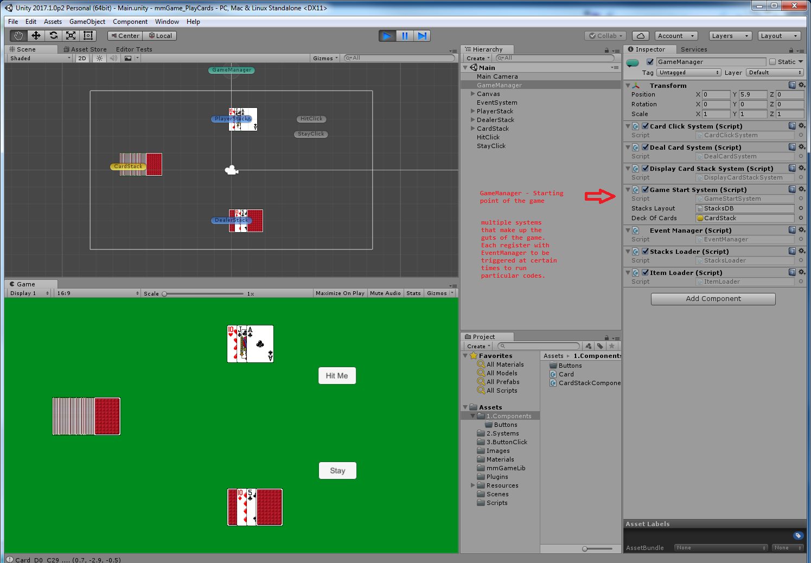

# Card Game Example using my managed ECS  (mmECS)
This is a simple and interactive Unity3d (2017 version) example project to show how to use mmECS (Entity Component System).
This ECS Framework specifically made for C# and Unity, using unity event manager to register and listen when certain code needs to be executed.

This example aims to demonstrate :

1. Create Components, attach them to Entities (GameObjects)

2. Create Events (to get the systems to communicate)

3. Create Systems (to do all the logic of the game)

## Install for Editor
To Install download mmECS files to a folder.
Go to \mmECS_CardGame_Example\mmGameLib_UnityEditor
there are 2 files

•51-EntityComponent-NewEntityComponent.cs

•52-EntitySystem-NewEntitySystem.cs

copy them to C:\Program Files\Unity\Editor\Data\Resources\ScriptTemplates and add the two template files
These 2 show up in your editor everytime you want to add a "new" script

Next Restart or Open your Unity project and go to Edit/ProjectSettings/Script Execution Order and Set EntityManager to -200 and Entity to -100.

Now do the following:

Create the usual script folders in Assets folder

	Components
	
	Systems
	
	Resources
	
	Scenes
	
	Sprites
	
	….
	
Drag in mmGameLib folder and add it to Assets

Create a game object – call it GameSystem (this is where everything happens)

	Add following components:
	
	Add mmGameLib -> EventManger
	
	Add ALL game systems as components.  Each system should implement following:
	
    void OnEnable()
	
    {
        EventManager.StartListening("GameEvent", Handle);
    }
	
    void OnDisable()
    {
        EventManager.StopListening("GameEvent", Handle);
    }
	
    void Handle(string value)
    {
    }
	
All other game objects

	Add any number of components that has the following method:
	
	private void OnEnable()
    {
        ObjectTracker.Register(this.GetType(), this.gameObject);
    }

	
## Sample Screen

ECS explained here https://www.gamedev.net/articles/programming/general-and-gameplay-programming/understanding-component-entity-systems-r3013/

